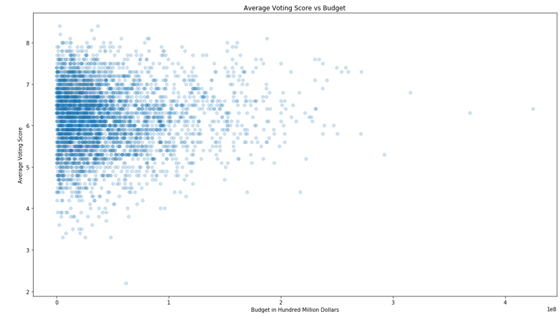
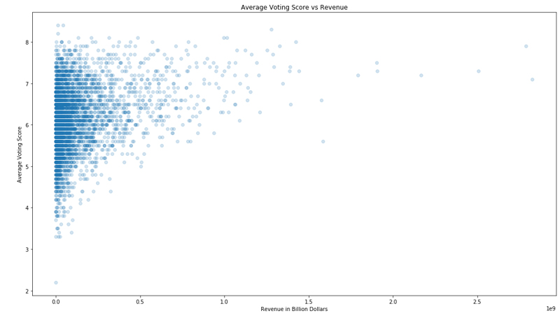
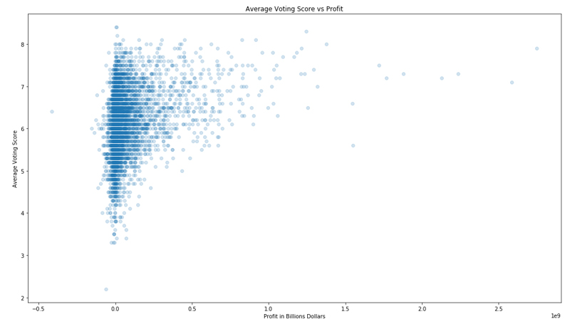
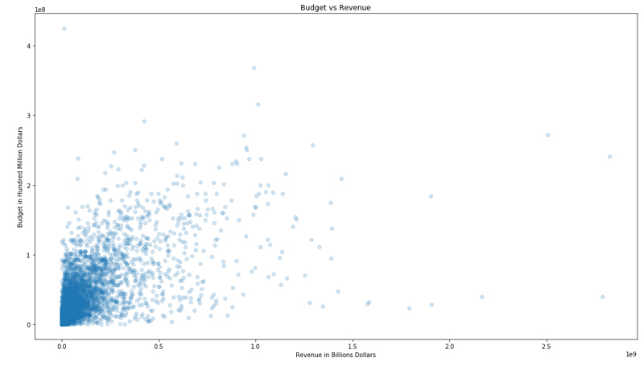
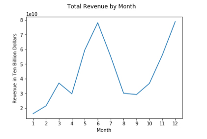
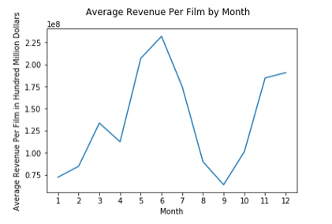
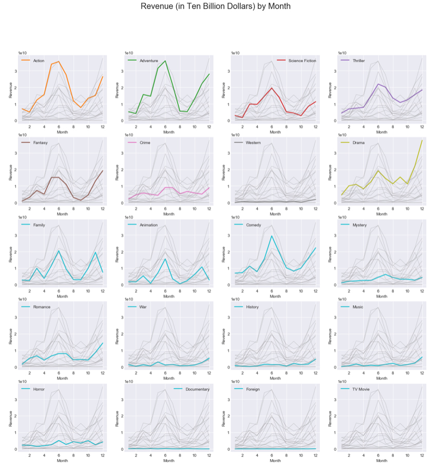

# OVERVIEW

This is Udacity's second project under Data Analyst Nanodegree Program. This project focused on the general data analysis process by using Numpy, pandas, Matplotlib (Completed on November 26, 2018)

For this project, our goal was to gain onhand experience with the data analysis process. As part of this project, we were familiarize ourselves with the typical data analysis process, pose questions about our chosen dataset, know how to investigate problems in a dataset and wrangle data, experience communicating results, be able to vectorize operations in NumpPy and Pandas, be familiar with pandas' Series and DataFrame objects, and know how to use Matplotlib to produce plots showing our findings.

I do want to make note that the goal of this project does not include inferential statistics or any machine learning techniques. This project's goals were to master the Data Analysis process by investigating a dataset from a list of given options.

We will be analyzing The Movie Database (TMDb) which contains information of over 10,000 films.

I am interested in taking a look at what makes a film successful. Success can take on a multitude of definitions but for our analysis, we shall define success as a film being both financially and critically well received.

For our analysis of the TMDb Movie Data, we will focus on the film's revenue (and profit) as well as the average voting score.

***

## QUESTION \#1

**Which director, genre, actor made the most/least profit, profit per film, and best/worst average rating?**

A. Directors

Our five most profitable directors are Steven Spielberg, James Cameron,George Lucas,Peter Jackson, and Robert Zemeckis. Our five least profitable directors are Sngmoo Lee, Aaron Blaise,Robert Walker,Rod Lurie, and John Bruno.
Our five most profitable per film directors are Irwin Winkler, Hamilton Luske,Clyde Geronimi,Richard Marquand, and Jennifer Lee. Our five least profitable directors are Sngmoo Lee, Aaron Blaise,Robert Walker,John Bruno, and Hugh Johnson.
Our five directors w/ best average voting score are Damien Chazelle, Morten Tyldum,Tony Kaye ,Xavier Dolan,Lenny Abrahamson. Our five directors w/ the worst average voting score are Lawrence Kasanoff, Charles McCracken,Uwe Boll ,Luca Bercovici ,John Bruno.

B. Genres

Our five most profitable genres are Adventure, Action,Drama,Comedy, and Thriller. Our five least profitable genres are Foreign, TV Movie, Documentary, Western, and History. Our five most profitable per film genres are Animation, Adventure,Family ,Fantasy, and Science Fiction. Our five least profitable genres are Foreign, Documentary,TV Movie ,Horror, and History. Our five genres w/ best average voting score are Documentary, War, History , Western ,and Drama. Our five genres w/ the worst average voting score are TV Movie, Horror,Science Fiction,Comedy, and Action.

C. Actors

Our five most profitable actors are Harrison Ford, Tom Cruise,Tom Hanks,Carrie Fisher, and Emma Watson. Our five least profitable actors are Jang Dong-gun, Ti Lung,Kate Bosworth,Emilio Echevarría, and David Hyde Pierce.
Our five most profitable per film actors are Jason Miller, Robert MacNaughton,Daisy Ridley ,Wendy Gazelle, and Ken Howard. Our five least profitable per film actors are Ti Lung, Jang Dong-gun,Emilio Echevarría ,Clive Russell, and Vladimir Kulich.
Our five actors w/ best average voting score are Chris Frantz, David Byrne,Steven Scales ,Jerry Harrison,and Tina Weymouth. Our five actors w/ the worst average voting score are Wayne Brady, Gary 'G. Thang' Johnson,Vanessa Lachey ,Amelia Curtis,and Crista Flanagan.

## QUESTION \#2

**How has the budget, revenue, and profit trend by average rating?**

Based on our data, the correlation between our average voting score and our variables (budget, revenue, and profit) shows to have a positive and very weak relationship.

## QUESTION \#3

**How has the budget trend over revenue?**

The correlation between the budget and revenue shows to have a positive weak relationship.

## QUESTION \#4

**How has the total revenue and average revenue per film trend per month?**

The total revenue for films seems to be at its lowest for films released in January. Contrary, the most total revenue generated are films released during the months of June through July and December.
Observing the average revenue per film seems to be at its lowest during months of January and September. Contrary, it is at its most for films released during the months of May through July.

## QUESTION \#5

**How has the revenue per genre trend by month?**

The most noticeably trend in our data shows that most genres (but not all) produce the most total revenue for films released during the months of June and December. For example, Actions, Adventure, Science Fiction and Comedy all show a spike in total revenue for films released in June. Similary, films released in December showed a spike in total revenue for genres of Action, Advenure, Drama, and Fantasy. Unexpectedly, I did notice a dip for films released in December of the genre Family and Animation.

